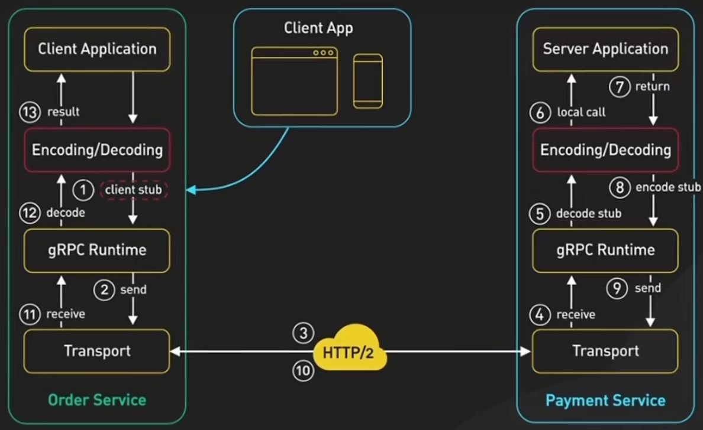
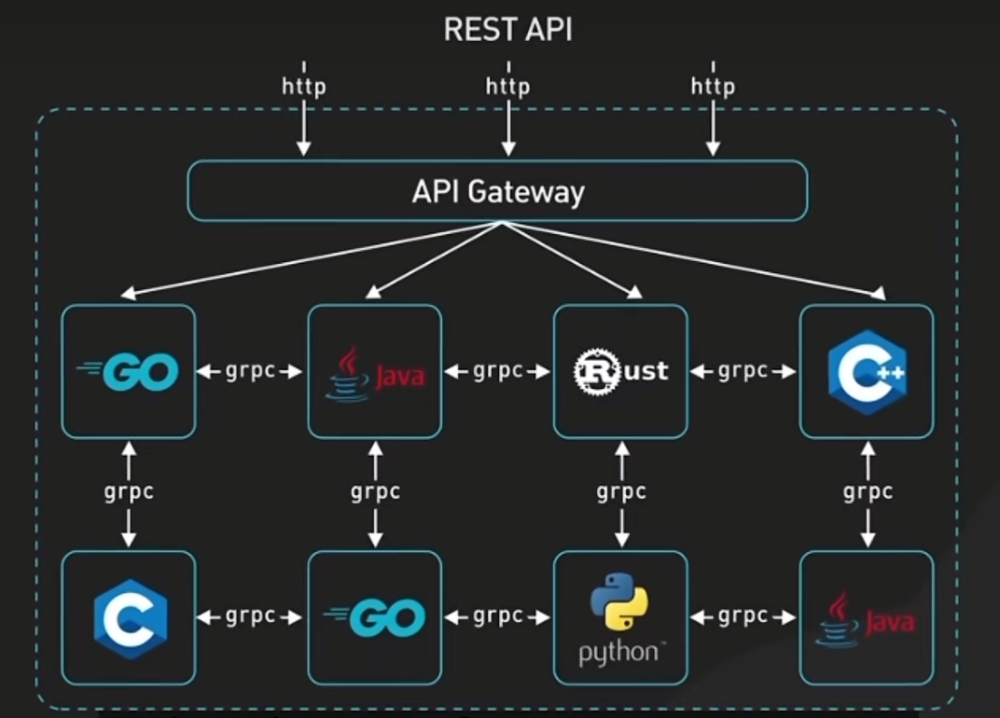
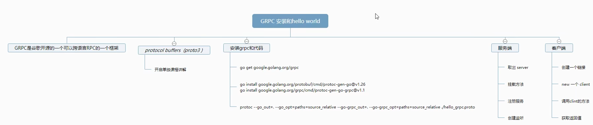

## 简介

> 参考资料：
>
> https://grpc.io/docs/languages/go/basics/
>
> https://doc.oschina.net/grpc?t=60133

### 说明

gRPC 是一个高性能、开源和通用的 RPC（远程过程调用）框架，由 Google 开发。它主要面向移动应用和 HTTP/2 设计，以实现低延迟、高速度、安全和跨平台的服务端和客户端通信。

gRPC 支持多种语言，包括 C++, Java, Python, Go, Ruby, C#, Node.js, Android Java 等。它允许你定义服务，指定其可以被远程调用的方法（包括参数和返回类型）。在服务器端，服务实现为用户提供定义的接口；在客户端，用户可以像调用本地方法一样直接调用这些接口。

gRPC 的一些主要特性包括：

1. **基于 HTTP/2**：gRPC 基于 HTTP/2 标准设计，能够提供比 HTTP/1.x 更强大的特性，如头部压缩、多路复用和流量控制等。
2. **支持多种语言**：gRPC 支持多种语言，使得你可以在不同的语言中创建和使用 gRPC 服务和客户端。
3. **使用 Protocol Buffers**：gRPC 默认使用 Protocol Buffers，这是 Google 的成熟的开源机制，用于序列化结构化的数据。
4. **双向流和元数据交换**：gRPC 支持双向流和元数据交换，使得客户端和服务器可以在一个连接中同时发送和接收数据。
5. **工具支持**：gRPC 提供了一套工具，可以帮助生成服务和消息接口代码。

你应该在以下情况下考虑使用 gRPC：

- 当你需要从一个应用中调用另一个应用的方法，就像它们是同一个进程中的本地方法一样。
- 当你需要处理大量的数据，尤其是需要在网络中传输的数据，而且需要高效的序列化机制。
- 当你需要设计一个跨语言、跨平台的服务，例如，你的服务需要同时支持 Web 客户端和移动客户端。

gRPC 的一般用途包括：

- 微服务架构：gRPC 非常适合微服务架构，因为它可以让你轻松地定义服务和创建客户端。这使得你可以轻松地构建和扩展你的服务。
- 实时系统：gRPC 的低延迟特性使得它非常适合实时系统，例如，游戏服务器或者高频交易系统。
- 点对点通信：gRPC 支持双向流，使得它非常适合需要点对点通信的应用，例如，聊天应用或者实时视频流应用。

### 过程



### 应用



### 使用脑图 



## 例子的代码和设置

教程的代码在这里 [grpc/grpc-go/examples/cpp/route_guide](https://github.com/grpc/grpc-go/tree/master/examples/route_guide)。 要下载例子，通过运行下面的命令去克隆`grpc-go`代码库：

```shell
$ go get google.golang.org/grpc
```

然后改变当前的目录到 `grpc-go/examples/route_guide`:

```shell
$ cd $GOPATH/src/google.golang.org/grpc/examples/route_guide
```
