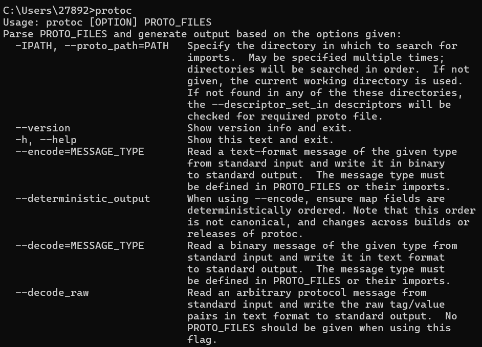
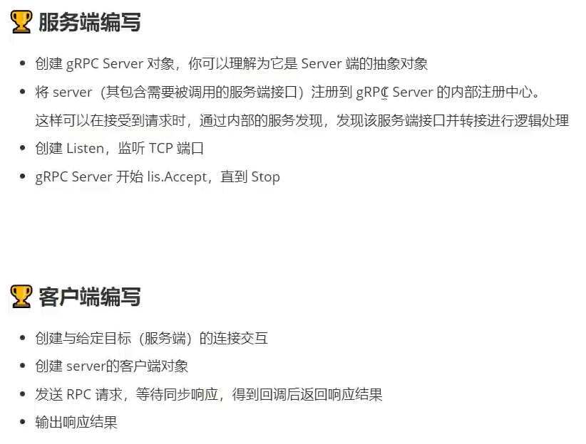

# 基本使用

## 简介

> 参考资料：
>
> https://grpc.io/docs/languages/go/basics/
>
> https://doc.oschina.net/grpc?t=60133

### 说明

gRPC 是一个高性能、开源和通用的 RPC（远程过程调用）框架，由 Google 开发。它主要面向移动应用和 HTTP/2 设计，以实现低延迟、高速度、安全和跨平台的服务端和客户端通信。

gRPC 支持多种语言，包括 C++, Java, Python, Go, Ruby, C#, Node.js, Android Java 等。它允许你定义服务，指定其可以被远程调用的方法（包括参数和返回类型）。在服务器端，服务实现为用户提供定义的接口；在客户端，用户可以像调用本地方法一样直接调用这些接口。

gRPC 的一些主要特性包括：

1. **基于 HTTP/2**：gRPC 基于 HTTP/2 标准设计，能够提供比 HTTP/1.x 更强大的特性，如头部压缩、多路复用和流量控制等。
2. **支持多种语言**：gRPC 支持多种语言，使得你可以在不同的语言中创建和使用 gRPC 服务和客户端。
3. **使用 Protocol Buffers**：gRPC 默认使用 Protocol Buffers，这是 Google 的成熟的开源机制，用于序列化结构化的数据。
4. **双向流和元数据交换**：gRPC 支持双向流和元数据交换，使得客户端和服务器可以在一个连接中同时发送和接收数据。
5. **工具支持**：gRPC 提供了一套工具，可以帮助生成服务和消息接口代码。

你应该在以下情况下考虑使用 gRPC：

- 当你需要从一个应用中调用另一个应用的方法，就像它们是同一个进程中的本地方法一样。
- 当你需要处理大量的数据，尤其是需要在网络中传输的数据，而且需要高效的序列化机制。
- 当你需要设计一个跨语言、跨平台的服务，例如，你的服务需要同时支持 Web 客户端和移动客户端。

gRPC 的一般用途包括：

- 微服务架构：gRPC 非常适合微服务架构，因为它可以让你轻松地定义服务和创建客户端。这使得你可以轻松地构建和扩展你的服务。
- 实时系统：gRPC 的低延迟特性使得它非常适合实时系统，例如，游戏服务器或者高频交易系统。
- 点对点通信：gRPC 支持双向流，使得它非常适合需要点对点通信的应用，例如，聊天应用或者实时视频流应用。


### 过程


### 应用


### 使用脑图


### 例子的代码和设置

教程的代码在这里 [grpc/grpc-go/examples/cpp/route_guide](https://github.com/grpc/grpc-go/tree/master/examples/route_guide)。 要下载例子，通过运行下面的命令去克隆`grpc-go`代码库：

```shell
$ go get google.golang.org/grpc
```

然后改变当前的目录到 `grpc-go/examples/route_guide`:

```shell
$ cd $GOPATH/src/google.golang.org/grpc/examples/route_guide
```

## 安装

### 安装protobuf

>https://github.com/protocolbuffers/protobuf/releases

解压之后将bin文件中的exe配置到环境变量中

打开终端输入`protoc`有结果表示安装成功



### 安装依赖

```go
go get google.golang.org/grpc
```

```go
go install google.golang.org/protobuf/cmd/protoc-gen-go@latest
go install google.golang.org/grpc/cmd/protoc-gen-go-grpc@latest
```


>安装好之后是可以到环境变量文件里看到的
>
>只此，准备工作准备完毕。

## 编写proto

### proto

```go
// 这是在说明我们使用的是proto3语法。
syntax = "proto3";

// 这部分的内容是关于最后生成的go文件是处在哪个目录哪个包中，代表在当前目录生成，service代表了生成的go文件的包名是service
option go_package = ".;service";

// 然后我们需要定义一个服务，在这个服务中需要有一个方法，这个方法可以接受客户端的参数，再返回服务端的响应。
// 其实很容易可以看出，我们定义了一个service，称为SayHello，这个服务中有一个rpc方法，名为SayHello。
// 这个方法会发送一个HelloRequest，然后返回一个HelloResponse。
service SayHello {
  rpc SayHello (HelloRequest) returns (HelloResponse);
}
// 也就是rpc接口 定义方法和接口  -- 核心

// message关键字，其实你可以理解为Golang中的结构体。
// 这里比较特别的是变量后面的“赋值”，注意，这里并不是赋值，而是在定义这个变量在这个message中的位置。
message HelloRequest {
  string requestName = 1;
  int64 age = 2;
  repeated string name = 3;
  // 要使用切片就用repeated 修改了该文件之后执行 protoc --go_out=. hello.proto
}

message HelloResponse {
  string responseMsg = 1;
}
```

>到`shello-server/proto下`执行下列命令： (其实其他语言就类似替换下面的go即可)
>
>```go
>protoc --go_out=. hello.proto
>
>protoc --go-grpc_out=. hello.proto
>```


使用切片

```
repeated string name = 3;
// 要使用切片就用repeated 修改了该文件之后执行 protoc --go_out=. hello.proto
```


# protoc介绍

### 一、message介绍

message：protobuf中定义一个消息类型是通过关键字message字段指定的。消息就算需要传输的数据格式的定义。message关键字类似于C++中的class，Java中的Class，go中的struct

例如：

```protobuf
message User{
	string username=1;
	int32 age=2;
}
```

在消息中承载的数据分别对应于每一个字段。

其中每个字段都有一个名字和一种类型。

### 二、字段规则

| 字段     | 作用                                                         |
| -------- | ------------------------------------------------------------ |
| required | 消息体中必填字段，不设置会导致编解码异常。一般不填就认为是必填字段了 |
| optional | 消息体中可选字段。生成的是对应的指针                         |
| repeated | 消息体中可重复字段，重复的值的顺序会被保留，在go中重复的会被定义为切片 |

例子：

定义一个结构

```protobuf
message User{
	string username=1;
	int32 age=2;  
	optional string password=3;  // 生成的是指针
	repeated string address=4;  // 生产的是切片
}
```

生成一下执行`protoc --go_out=./ .\user.proto`

生成下面的文件

```go
type User struct {
    state protoimpl.MessageState
    sizeCache protoimpl.SizeCache
    unknownFields protoimpl.UnknownFields
    
    Username string `protobuf:"bytes,1,opt,name=username,proto3" json:"username,omitempty"`
    Age int32 `prtobuf:"varint,2,opt,name=age,proto3" json:"age,omitempty"`
    Password *string `protobuf:"bytes,3,opt,name=password,proto3,oneof" json:"password,omiyempty"`
    Address []string `protobuf:"bytes,4,rep,name=address,proto3" json:"address,omitempty"`
}
```

可以看到Address变成了一个切片

### 三、字段映射

| **.proto Type** | **Notes**                                                    | **C++ Type** | **Python Type** | **Go Type** |
| --------------- | ------------------------------------------------------------ | ------------ | --------------- | ----------- |
| double          |                                                              | double       | float           | float64     |
| float           |                                                              | float        | float           | float32     |
| int32           | 使用变长编码，对于负值的效率很低，如果你的域有 可能有负值，请使用sint64替代 | int32        | int             | int32       |
| uint32          | 使用变长编码                                                 | uint32       | int/long        | uint32      |
| uint64          | 使用变长编码                                                 | uint64       | int/long        | uint64      |
| sint32          | 使用变长编码，这些编码在负值时比int32高效的多                | int32        | int             | int32       |
| sint64          | 使用变长编码，有符号的整型值。编码时比通常的 int64高效。     | int64        | int/long        | int64       |
| fixed32         | 总是4个字节，如果数值总是比总是比228大的话，这 个类型会比uint32高效。 | uint32       | int             | uint32      |
| fixed64         | 总是8个字节，如果数值总是比总是比256大的话，这 个类型会比uint64高效。 | uint64       | int/long        | uint64      |
| sfixed32        | 总是4个字节                                                  | int32        | int             | int32       |
| sfixed32        | 总是4个字节                                                  | int32        | int             | int32       |
| sfixed64        | 总是8个字节                                                  | int64        | int/long        | int64       |
| bool            |                                                              | bool         | bool            | bool        |
| string          | 一个字符串必须是UTF-8编码或者7-bit ASCII编码的文 本。        | string       | str/unicode     | string      |
| bytes           | 可能包含任意顺序的字节数据。                                 | string       | str             | []byte      |

### 四、默认值

protobuf3删除了protobuf2中用来设置默认值的default关键字，取而代之的是protobuf3为各类型定义的默认值，也就是约定的默认值，如下表：

| 类型     | 默认值                                                       |
| -------- | ------------------------------------------------------------ |
| bool     | flase                                                        |
| 整型     | 0                                                            |
| string   | 空字符串""                                                   |
| 枚举enum | 第一个枚举元素的值，因为Protobuf3强制要求第一个枚举元素的值必须是0，所以枚举的默认值就是0 |
| message  | 不是null，而是DEFAULT_INSTANCE                               |

### 五、标识号

标识号：在消息体的定义中，每个字段都必须要有一个唯一的标识号，标识号是[0.2^29-1]范围内的一个整数。

```protobuf
message User{
	string username=1;  // 位置1
	int32 age=2;
	optional string password=3;
	repeated string address=4;  // 位置4
}
```

以Person为例，name=1，id=2，email=3，phones=4中的1- 4就是标识号

### 六、定义多个消息队列

一个proto文件中可以定义多个消息类型

```protobuf
message UserRequest{
	string username=1;   // 位置1
	int32 age=2;
	optional string password=3;
	repeated string address=4;  // 位置4
}
message UserResponse{
	string username=1;
	int32 age=2;
	optional string password=3;
	repeated string address=4;
}
```

### 七、嵌套消息

可以在其他消息类型中定义，使用消息类型，在下面的例子中，Person消息就定义在PersonInfo消息内

```protobuf
message PersonInfo{
	message Person{
		string name=1;
		int32 height=2;
		repeated int32 weight=3;
	}
	repeated Person info=1;
}
```

如果你想在它的父消息类型的外部重用这个消息类型，你需要以PersonInfo.Person的形式来使用它，如：

```protobuf
message PersonMessage{
	PersonInfo.Person info=1;
}
```

当然也可以消息嵌套多层，比如

```protobuf
message Grandpa {
	message Father {
		message Son{
			string name=1;
			int32 age=2;
		}
	}
	message Uncle{
		message Son{
			string name=1;
			int32 age=1;
		}
	}
}
```

### 八、定义服务

如果想要将消息类型用在rpc系统中，可以在.proto文件中定义一个rpc服务接口，protocolbuffer编译器会根据所选择的不同语言生成服务接口代码及存根。

```protobuf
service SearchService{
	// rpc 服务的函数名（传入参数）返回（返回参数）
    rpc Search(UserRequest) returns(UserResponse);
}
```

上述代表表示，定义了一个RPC服务，该方法接收SearchRequest返回SearchResponse

# 客户端/服务端编写



## 服务端代码

```go
package main

import (
	"context"
	"fmt"
	pb "grpc/hello-server/proto"
	"net"

	"google.golang.org/grpc"
)

// 前面的grpc是module名字，后面的hello-server是目录名字 就是定义时 go mod init grpc/hello-server

// hello server
type server struct {
	pb.UnimplementedSayHelloServer
}

func (s *server) SayHello(ctx context.Context, req *pb.HelloRequest) (*pb.HelloResponse, error) {
	fmt.Println("request name:", req.RequestName)
	return &pb.HelloResponse{
		ResponseMsg: "hello " + req.RequestName,
	}, nil
}

func main() {
	// 开启端口
	listen, _ := net.Listen("tcp", ":9090")
	// 创建grpc服务
	grpcServer := grpc.NewServer()
	// 在grpc服务上注册自己编写的服务
	pb.RegisterSayHelloServer(grpcServer, &server{})

	// 启动grpc服务
	err := grpcServer.Serve(listen)
	if err != nil {
		fmt.Printf("failed to serve:%v\n", err)
		return
	}
}
```

## 客户端代码

```go
package main

import (
	"context"
	"fmt"
	"log"

	pb "grpc/hello-server/proto"

	"google.golang.org/grpc"
	"google.golang.org/grpc/credentials/insecure"
)

func main() {
	// 连接到server端，此处禁用安全传输，没有加密和验证
	conn, err := grpc.Dial("localhost:9090", grpc.WithTransportCredentials(insecure.NewCredentials()))
	if err != nil {
		log.Fatalf("did not connect: %v", err)
	}
	defer conn.Close()
	// go语言标准连接处理

	// 创建一个客户端
	client := pb.NewSayHelloClient(conn)

	resp, err := client.SayHello(context.Background(), &pb.HelloRequest{RequestName: "mobaiclient", Age: 18, Name: []string{"mobai", "mobai2"}})
	if err != nil {
		log.Fatalf("could not greet: %v", err)
	}

	fmt.Println(resp.GetResponseMsg())
}
```

服务端显示结果：


客户端显示结果：


# TLS认证编写

## 生成证书

### openssl

https://slproweb.com/products/Win32OpenSSL.html

### 在线生成

https://www.ssleye.com/ssltool/self_sign.html

主要得到下面两个文件

- 私钥
- 公钥


## 代码

### 服务端

```go
func main() {
	// 自签证书和私钥文件    -- 主要改动代码在这里
	creds, err := credentials.NewServerTLSFromFile("../key/test.pem", "../key/test.key")
	if err != nil {
		log.Fatalf("Failed to generate credentials %v", err)
	}

	// 开启端口
	listen, err := net.Listen("tcp", ":9090")
	if err != nil {
		log.Fatalf("Failed to listen on port 9090: %v", err)
	}

	// 创建grpc服务
	grpcServer := grpc.NewServer(grpc.Creds(creds)) // 传入证书

	// 在grpc服务上注册自己编写的服务
	pb.RegisterSayHelloServer(grpcServer, &server{})

	// 启动grpc服务
	err = grpcServer.Serve(listen)
	if err != nil {
		log.Fatalf("Failed to serve: %v", err)
	}
}
```

### 客户端

```go
func main() {
	creds, err := credentials.NewClientTLSFromFile("../key/test.pem", "test.com")
	if err != nil {
		log.Fatalf("Failed to generate credentials %v", err)
	}

	// 连接到server端，此处启用安全传输，包括加密和验证
	conn, err := grpc.Dial("localhost:9090", grpc.WithTransportCredentials(creds))
	if err != nil {
		log.Fatalf("Failed to connect: %v", err)
	}
	defer conn.Close()
	// go语言标准连接处理

	// 创建一个客户端
	client := pb.NewSayHelloClient(conn)

	resp, err := client.SayHello(context.Background(), &pb.HelloRequest{RequestName: "mobaiclient", Age: 18, Name: []string{"mobai", "mobai2"}})
	if err != nil {
		log.Fatalf("could not greet: %v", err)
	}

	fmt.Println(resp.GetResponseMsg())
}
```

## Token认证编写


### 结果如下

认证正确的结果：


认证错误的结果：


### 代码如下

#### 服务端

```go
package main

import (
	"context"
	"errors"
	"fmt"
	pb "grpc/hello-server/proto"
	"net"

	"google.golang.org/grpc"
	"google.golang.org/grpc/metadata"
)

type server struct {
	pb.UnimplementedSayHelloServer
}

func (s *server) SayHello(ctx context.Context, req *pb.HelloRequest) (*pb.HelloResponse, error) {
	md, ok := metadata.FromIncomingContext(ctx)
	if !ok {
		return nil, errors.New("missing token")
	}
	var appId, appKey string
	if val, ok := md["appid"]; ok {
		appId = val[0]
	}
	if val, ok := md["appkey"]; ok {
		appKey = val[0]
	}
	if appId != "mobai" || appKey != "123123" {
		return nil, errors.New("invalid token")
	}
	// 上面是token认证

	fmt.Println("request name:", req.RequestName)
	return &pb.HelloResponse{
		ResponseMsg: "hello " + req.RequestName,
	}, nil
}

func main() {
	listen, err := net.Listen("tcp", ":9090")
	if err != nil {
		fmt.Printf("Failed to listen on port 9090: %v\n", err)
		return
	}
	grpcServer := grpc.NewServer()
	pb.RegisterSayHelloServer(grpcServer, &server{})
	err = grpcServer.Serve(listen)
	if err != nil {
		fmt.Printf("Failed to serve: %v\n", err)
	}
}
```

#### 客户端

```go
package main

import (
	"context"
	"fmt"
	"log"

	pb "grpc/hello-server/proto"

	"google.golang.org/grpc"
	"google.golang.org/grpc/credentials/insecure"
)

/*
type PerRPCCredentials interface {
	GetRequestMetadata(ctx context.Context, uri ...string) (map[string]string, error)
	RequireTransportSecurity() bool
}
*/

type ClientTokenAuth struct{}

func (c ClientTokenAuth) GetRequestMetadata(ctx context.Context, uri ...string) (map[string]string, error) {
	return map[string]string{
		"appId":  "mobaia",
		"appKey": "123123",
	}, nil
}

func (c ClientTokenAuth) RequireTransportSecurity() bool {
	return false
}

func main() {
	// 连接到server端，此处禁用安全传输，没有加密和验证
	var opts []grpc.DialOption
	opts = append(opts, grpc.WithTransportCredentials(insecure.NewCredentials()))
	opts = append(opts, grpc.WithPerRPCCredentials(new(ClientTokenAuth)))
	conn, err := grpc.Dial("localhost:9090", opts...)
	if err != nil {
		log.Fatalf("did not connect: %v", err)
	}
	defer conn.Close()
	// go语言标准连接处理

	// 创建一个客户端
	client := pb.NewSayHelloClient(conn)

	resp, err := client.SayHello(context.Background(), &pb.HelloRequest{RequestName: "mobaiclient", Age: 18, Name: []string{"mobai", "mobai2"}})
	if err != nil {
		log.Fatalf("could not greet: %v", err)
	}

	fmt.Println(resp.GetResponseMsg())
}

/*
// 证书认证
creds, err := credentials.NewClientTLSFromFile("path/to/cert.pem", "")
if err != nil {
    log.Fatalf("Failed to generate credentials %v", err)
}

var opts []grpc.DialOption
opts = append(opts, grpc.WithTransportCredentials(creds))
opts = append(opts, grpc.WithPerRPCCredentials(new(ClientTokenAuth)))

conn, err := grpc.Dial("localhost:9090", opts...)
if err != nil {
    log.Fatalf("did not connect: %v", err)
}
*/

```
