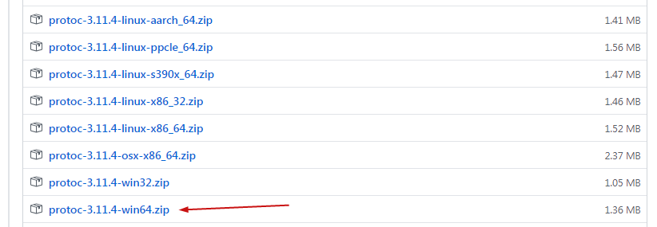
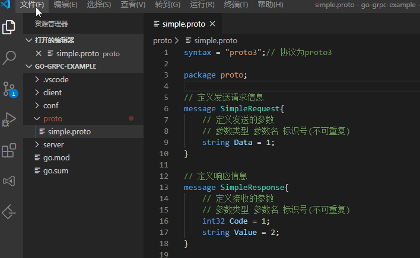

# [Go gRPC教程-环境安装（一）](https://www.cnblogs.com/FireworksEasyCool/p/12669371.html)

### 前言[#](https://www.cnblogs.com/FireworksEasyCool/p/12669371.html#825018497)

- gRPC 是一个高性能、开源和通用的 RPC 框架，面向移动和 HTTP/2 设计，带来诸如双向流、流控、头部压缩、单 TCP 连接上的多复用请求等特。这些特性使得其在移动设备上表现更好，更省电和节省空间占用。
- 在 gRPC 里客户端应用可以像调用本地对象一样直接调用另一台不同的机器上服务端应用的方法，使得您能够更容易地创建分布式应用和服务。
- gRPC 默认使用 protocol buffers，这是 Google 开源的一套成熟的结构数据序列化机制，它的作用与 XML、json 类似，但它是二进制格式，性能好、效率高（缺点：可读性差）。

### 安装 protobuf[#](https://www.cnblogs.com/FireworksEasyCool/p/12669371.html#1307165860)

1.下载地址：https://github.com/protocolbuffers/protobuf/releases

根据自身电脑的操作系统，选择最新的releases版本下载

[](https://img2020.cnblogs.com/blog/1508611/202004/1508611-20200409190731232-700613932.png)

2.解压后在bin目录找到protoc.exe，然后把它复制到GOBIN目录下

> 一般操作是把protoc.exe所在的目录配到环境变量里，这里直接把protoc.exe复制到GOBIN目录下，前提是环境变量已经配置了GOBIN环境变量。

3.打开cmd，运行`protoc --version`

成功打印当前版本信息证明安装成功了。

### 安装相关包[#](https://www.cnblogs.com/FireworksEasyCool/p/12669371.html#1429743062)

安装 golang 的proto工具包

```
go get -u github.com/golang/protobuf/proto
```

安装 goalng 的proto编译支持

```
go get -u github.com/golang/protobuf/protoc-gen-go
```

安装 gRPC 包

```
go get -u google.golang.org/grpc
```

### 创建并编译proto文件[#](https://www.cnblogs.com/FireworksEasyCool/p/12669371.html#3526556568)

1.新建proto文件夹，在里面新建simple.proto文件

```protobuf
Copy syntax = "proto3";// 协议为proto3

package proto;

// 定义发送请求信息
message SimpleRequest{
    // 定义发送的参数
    // 参数类型 参数名 标识号(不可重复)
    string data = 1;
}

// 定义响应信息
message SimpleResponse{
    // 定义接收的参数
    // 参数类型 参数名 标识号(不可重复)
    int32 code = 1;
    string value = 2;
}

// 定义我们的服务（可定义多个服务,每个服务可定义多个接口）
service Simple{
    rpc Route (SimpleRequest) returns (SimpleResponse){};
}
```

2.编译proto文件

cmd进入simple.proto所在目录，运行以下指令进行编译

```
protoc --go_out=plugins=grpc:./ ./simple.proto
```

### VSCode-proto3插件介绍[#](https://www.cnblogs.com/FireworksEasyCool/p/12669371.html#3214696591)

> 使用VSCode的朋友看这里，博主介绍一个VSCode插件，方便对编辑和编译proto文件。
>
> - 扩展程序中搜索 `VSCode-proto3`，然后点击安装。
> - 在设置中找到setting.json文件，添加vscode-proto3插件配置

```json
Copy   // vscode-proto3插件配置
    "protoc": {
        // protoc.exe所在目录
        "path": "C:\\Go\\bin\\protoc.exe",
        // 保存时自动编译
        "compile_on_save": true,
        "options": [
            // go编译输出指令
            "--go_out=plugins=grpc:."
        ]
    }
```

每次编辑完proto文件后，只需要保存，它就会自动帮助完成编译。而且代码有高亮显示，代码自动补全，代码格式化等功能。

[](https://img2020.cnblogs.com/blog/1508611/202004/1508611-20200409201719878-445176439.gif)

教程源码地址：https://github.com/Bingjian-Zhu/go-grpc-example