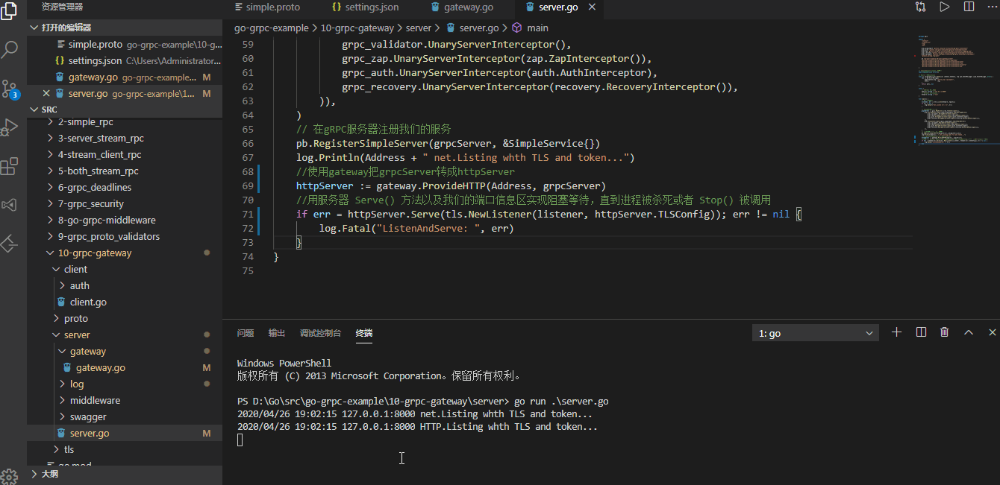
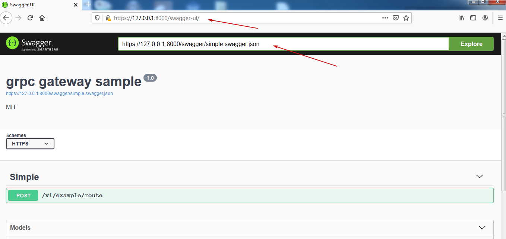
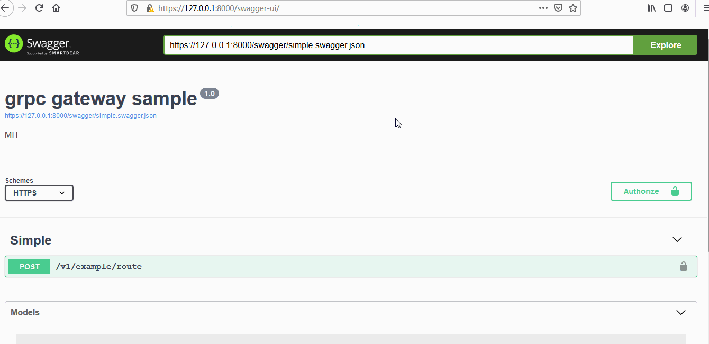
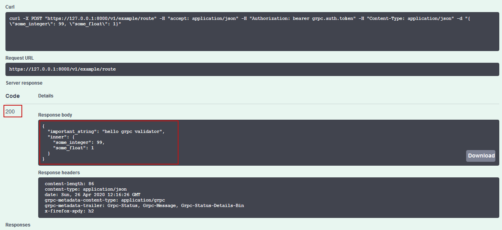
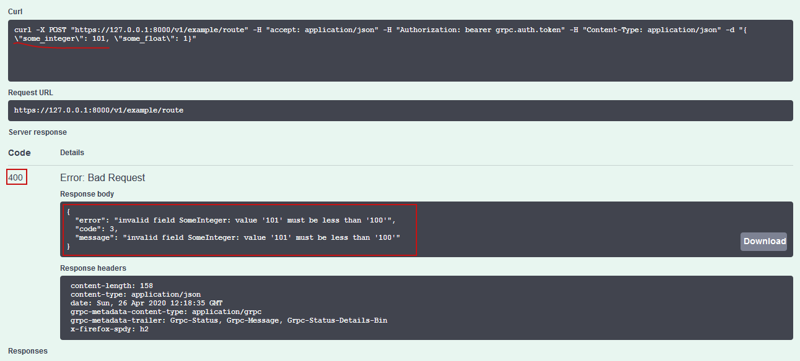

# [Go gRPC进阶-gRPC转换HTTP（十） ](https://www.cnblogs.com/FireworksEasyCool/p/12782137.html)

### 前言[#](https://www.cnblogs.com/FireworksEasyCool/p/12782137.html#890607599)

我们通常把`RPC`用作内部通信，而使用`Restful Api`进行外部通信。为了避免写两套应用，我们使用[grpc-gateway](https://github.com/grpc-ecosystem/grpc-gateway)把`gRPC`转成`HTTP`。服务接收到`HTTP`请求后，`grpc-gateway`把它转成`gRPC`进行处理，然后以`JSON`形式返回数据。本篇代码以上篇为基础，最终转成的`Restful Api`支持`bearer token`验证、数据验证，并添加`swagger`文档。

### gRPC转成HTTP[#](https://www.cnblogs.com/FireworksEasyCool/p/12782137.html#3307791553)

#### 编写和编译proto

1.编写simple.proto

```protobuf
Copysyntax = "proto3";

package proto;

import "github.com/mwitkow/go-proto-validators/validator.proto";
import "go-grpc-example/10-grpc-gateway/proto/google/api/annotations.proto";

message InnerMessage {
  // some_integer can only be in range (1, 100).
  int32 some_integer = 1 [(validator.field) = {int_gt: 0, int_lt: 100}];
  // some_float can only be in range (0;1).
  double some_float = 2 [(validator.field) = {float_gte: 0, float_lte: 1}];
}

message OuterMessage {
  // important_string must be a lowercase alpha-numeric of 5 to 30 characters (RE2 syntax).
  string important_string = 1 [(validator.field) = {regex: "^[a-z]{2,5}$"}];
  // proto3 doesn't have `required`, the `msg_exist` enforces presence of InnerMessage.
  InnerMessage inner = 2 [(validator.field) = {msg_exists : true}];
}

service Simple{
  rpc Route (InnerMessage) returns (OuterMessage){
      option (google.api.http) ={
          post:"/v1/example/route"
          body:"*"
      };
  }
}
```

可以看到，`proto`变化不大，只是添加了API的路由路径

```protobuf
Copy      option (google.api.http) ={
          post:"/v1/example/route"
          body:"*"
      };
```

2.编译`simple.proto`

`simple.proto`文件引用了`google/api/annotations.proto`（[来源](https://github.com/grpc-ecosystem/grpc-gateway/tree/master/third_party/googleapis/google/api)），先要把它编译了。我这里是把`google/`文件夹直接复制到项目中的`proto/`目录中进行编译。发现`annotations.proto`引用了`google/api/http.proto`，那把它也编译了。

进入`annotations.proto`所在目录，编译：

```powershell
Copyprotoc --go_out=plugins=grpc:./ ./http.proto
protoc --go_out=plugins=grpc:./ ./annotations.proto
```

进入`simple.proto`所在目录，编译：

```powershell
Copy#生成simple.validator.pb.go和simple.pb.go
protoc --govalidators_out=. --go_out=plugins=grpc:./ ./simple.proto
#生成simple.pb.gw.go
protoc --grpc-gateway_out=logtostderr=true:./ ./simple.proto
```

以上完成`proto`编译，接着修改服务端代码。

#### 服务端代码修改

1.`server/`文件夹下新建`gateway/`目录，然后在里面新建`gateway.go`文件

```go
Copypackage gateway

import (
	"context"
	"crypto/tls"
	"io/ioutil"
	"log"
	"net/http"
	"strings"

	pb "go-grpc-example/10-grpc-gateway/proto"
	"go-grpc-example/10-grpc-gateway/server/swagger"

	"github.com/grpc-ecosystem/grpc-gateway/runtime"
	"golang.org/x/net/http2"
	"golang.org/x/net/http2/h2c"
	"google.golang.org/grpc"
	"google.golang.org/grpc/credentials"
	"google.golang.org/grpc/grpclog"
)

// ProvideHTTP 把gRPC服务转成HTTP服务，让gRPC同时支持HTTP
func ProvideHTTP(endpoint string, grpcServer *grpc.Server) *http.Server {
	ctx := context.Background()
	//获取证书
	creds, err := credentials.NewClientTLSFromFile("../tls/server.pem", "go-grpc-example")
	if err != nil {
		log.Fatalf("Failed to create TLS credentials %v", err)
	}
	//添加证书
	dopts := []grpc.DialOption{grpc.WithTransportCredentials(creds)}
	//新建gwmux，它是grpc-gateway的请求复用器。它将http请求与模式匹配，并调用相应的处理程序。
	gwmux := runtime.NewServeMux()
	//将服务的http处理程序注册到gwmux。处理程序通过endpoint转发请求到grpc端点
	err = pb.RegisterSimpleHandlerFromEndpoint(ctx, gwmux, endpoint, dopts)
	if err != nil {
		log.Fatalf("Register Endpoint err: %v", err)
	}
	//新建mux，它是http的请求复用器
	mux := http.NewServeMux()
	//注册gwmux
	mux.Handle("/", gwmux)
	log.Println(endpoint + " HTTP.Listing whth TLS and token...")
	return &http.Server{
		Addr:      endpoint,
		Handler:   grpcHandlerFunc(grpcServer, mux),
		TLSConfig: getTLSConfig(),
	}
}

// grpcHandlerFunc 根据不同的请求重定向到指定的Handler处理
func grpcHandlerFunc(grpcServer *grpc.Server, otherHandler http.Handler) http.Handler {
	return h2c.NewHandler(http.HandlerFunc(func(w http.ResponseWriter, r *http.Request) {
		if r.ProtoMajor == 2 && strings.Contains(r.Header.Get("Content-Type"), "application/grpc") {
			grpcServer.ServeHTTP(w, r)
		} else {
			otherHandler.ServeHTTP(w, r)
		}
	}), &http2.Server{})
}

// getTLSConfig获取TLS配置
func getTLSConfig() *tls.Config {
	cert, _ := ioutil.ReadFile("../tls/server.pem")
	key, _ := ioutil.ReadFile("../tls/server.key")
	var demoKeyPair *tls.Certificate
	pair, err := tls.X509KeyPair(cert, key)
	if err != nil {
		grpclog.Fatalf("TLS KeyPair err: %v\n", err)
	}
	demoKeyPair = &pair
	return &tls.Config{
		Certificates: []tls.Certificate{*demoKeyPair},
		NextProtos:   []string{http2.NextProtoTLS}, // HTTP2 TLS支持
	}
}
```

它主要作用是把不用的请求重定向到指定的服务处理，从而实现把`HTTP`请求转到`gRPC`服务。

2.gRPC支持HTTP

```go
Copy    //使用gateway把grpcServer转成httpServer
	httpServer := gateway.ProvideHTTP(Address, grpcServer)
	if err = httpServer.Serve(tls.NewListener(listener, httpServer.TLSConfig)); err != nil {
		log.Fatal("ListenAndServe: ", err)
	}
```

#### 使用postman测试

[](https://img2020.cnblogs.com/blog/1508611/202004/1508611-20200426190917132-305705093.gif)

在动图中可以看到，我们的`gRPC`服务已经同时支持`RPC`和`HTTP`请求了，而且API接口支持`bearer token`验证和数据验证。为了方便对接，我们把API接口生成`swagger`文档。

### 生成swagger文档[#](https://www.cnblogs.com/FireworksEasyCool/p/12782137.html#2649358023)

#### 生成swagger文档-simple.swagger.json

1.安装`protoc-gen-swagger`

```
go get -u github.com/grpc-ecosystem/grpc-gateway/protoc-gen-swagger
```

2.编译生成simple.swagger.json

到simple.proto文件目录下，编译：
`protoc --swagger_out=logtostderr=true:./ ./simple.proto`

> 再次提一下，本人在VSCode中使用`VSCode-proto3`插件，[第一篇](https://www.cnblogs.com/FireworksEasyCool/p/12669371.html)有介绍，只要保存，就会自动编译，很方便，无需记忆指令。完整配置如下：

```swift
Copy    // vscode-proto3插件配置
    "protoc": {
        // protoc.exe所在目录
        "path": "C:\\Go\\bin\\protoc.exe",
        // 保存时自动编译
        "compile_on_save": true,
        "options": [
            "--go_out=plugins=grpc:.",//在当前目录编译输出.pb.go文件
            "--govalidators_out=.",//在当前目录编译输出.validator.pb文件
            "--grpc-gateway_out=logtostderr=true:.",//在当前目录编译输出.pb.gw.go文件
            "--swagger_out=logtostderr=true:."//在当前目录编译输出.swagger.json文件
        ]
    }
```

编译生成后把需要的文件留下，不需要的删掉。

#### 把swagger-ui转成Go代码，备用

1.下载`swagger-ui`

[下载地址](https://github.com/swagger-api/swagger-ui)，把`dist`目录下的所有文件拷贝我们项目的`server/swagger/swagger-ui/`目录下。

2.把`Swagger UI`转换为Go代码

安装`go-bindata`：
`go get -u github.com/jteeuwen/go-bindata/...`

回到`server/`所在目录，运行指令把`Swagger UI`转成Go代码。
`go-bindata --nocompress -pkg swagger -o swagger/datafile.go swagger/swagger-ui/...`

- 这步有坑，必须要回到`main`函数所在的目录运行指令，因为生成的Go代码中的`_bindata` 映射了`swagger-ui`的路径，程序是根据这些路径来找页面的。如果没有在`main`函数所在的目录运行指令，则生成的路径不对，会报404，无法找到页面。本项目`server/`端的`main`函数在`server.go`中，所以在`server/`所在目录下运行指令。

```go
Copyvar _bindata = map[string]func() (*asset, error){
	"swagger/swagger-ui/favicon-16x16.png": swaggerSwaggerUiFavicon16x16Png,
	"swagger/swagger-ui/favicon-32x32.png": swaggerSwaggerUiFavicon32x32Png,
	"swagger/swagger-ui/index.html": swaggerSwaggerUiIndexHtml,
	"swagger/swagger-ui/oauth2-redirect.html": swaggerSwaggerUiOauth2RedirectHtml,
	"swagger/swagger-ui/swagger-ui-bundle.js": swaggerSwaggerUiSwaggerUiBundleJs,
	"swagger/swagger-ui/swagger-ui-bundle.js.map": swaggerSwaggerUiSwaggerUiBundleJsMap,
	"swagger/swagger-ui/swagger-ui-standalone-preset.js": swaggerSwaggerUiSwaggerUiStandalonePresetJs,
	"swagger/swagger-ui/swagger-ui-standalone-preset.js.map": swaggerSwaggerUiSwaggerUiStandalonePresetJsMap,
	"swagger/swagger-ui/swagger-ui.css": swaggerSwaggerUiSwaggerUiCss,
	"swagger/swagger-ui/swagger-ui.css.map": swaggerSwaggerUiSwaggerUiCssMap,
	"swagger/swagger-ui/swagger-ui.js": swaggerSwaggerUiSwaggerUiJs,
	"swagger/swagger-ui/swagger-ui.js.map": swaggerSwaggerUiSwaggerUiJsMap,
}
```

#### 对外提供swagger-ui

1.在`swagger/`目录下新建`swagger.go`文件

```go
Copypackage swagger

import (
	"log"
	"net/http"
	"path"
	"strings"

	assetfs "github.com/elazarl/go-bindata-assetfs"
)

//ServeSwaggerFile 把proto文件夹中的swagger.json文件暴露出去
func ServeSwaggerFile(w http.ResponseWriter, r *http.Request) {
	if !strings.HasSuffix(r.URL.Path, "swagger.json") {
		log.Printf("Not Found: %s", r.URL.Path)
		http.NotFound(w, r)
		return
	}

	p := strings.TrimPrefix(r.URL.Path, "/swagger/")
	// "../proto/"为.swagger.json所在目录
	p = path.Join("../proto/", p)

	log.Printf("Serving swagger-file: %s", p)

	http.ServeFile(w, r, p)
}

//ServeSwaggerUI 对外提供swagger-ui
func ServeSwaggerUI(mux *http.ServeMux) {
	fileServer := http.FileServer(&assetfs.AssetFS{
		Asset:    Asset,
		AssetDir: AssetDir,
		Prefix:   "swagger/swagger-ui", //swagger-ui文件夹所在目录
	})
	prefix := "/swagger-ui/"
	mux.Handle(prefix, http.StripPrefix(prefix, fileServer))
}
```

2.注册`swagger`

在`gateway.go`中添加如下代码

```go
Copy	//注册swagger
	mux.HandleFunc("/swagger/", swagger.ServeSwaggerFile)
	swagger.ServeSwaggerUI(mux)
```

到这里我们已经完成了`swagger`文档的添加工作了，由于谷歌浏览器不能使用自己制作的TLS证书，所以我们用火狐浏览器进行测试。

用火狐浏览器打开：https://127.0.0.1:8000/swagger-ui/

在最上面地址栏输入：https://127.0.0.1:8000/swagger/simple.swagger.json

然后就可以看到swagger生成的API文档了。

[](https://img2020.cnblogs.com/blog/1508611/202004/1508611-20200426200056107-1097342377.png)

还有个问题，我们使用了bearer token进行接口验证的，怎么把`bearer token`也添加到swagger中呢？
最后我在`grpc-gateway`GitHub上的这个[Issues](https://github.com/grpc-ecosystem/grpc-gateway/issues/1089)找到解决办法。

#### 在swagger中配置`bearer token`

1.修改`simple.proto`文件

```protobuf
Copysyntax = "proto3";

package proto;

import "github.com/mwitkow/go-proto-validators/validator.proto";
import "go-grpc-example/10-grpc-gateway/proto/google/api/annotations.proto";
import "go-grpc-example/10-grpc-gateway/proto/google/options/annotations.proto";

message InnerMessage {
  // some_integer can only be in range (1, 100).
  int32 some_integer = 1 [(validator.field) = {int_gt: 0, int_lt: 100}];
  // some_float can only be in range (0;1).
  double some_float = 2 [(validator.field) = {float_gte: 0, float_lte: 1}];
}

message OuterMessage {
  // important_string must be a lowercase alpha-numeric of 5 to 30 characters (RE2 syntax).
  string important_string = 1 [(validator.field) = {regex: "^[a-z]{2,5}$"}];
  // proto3 doesn't have `required`, the `msg_exist` enforces presence of InnerMessage.
  InnerMessage inner = 2 [(validator.field) = {msg_exists : true}];
}

option (grpc.gateway.protoc_gen_swagger.options.openapiv2_swagger) = {
  security_definitions: {
    security: {
      key: "bearer"
      value: {
        type: TYPE_API_KEY
        in: IN_HEADER
        name: "Authorization"
        description: "Authentication token, prefixed by Bearer: Bearer <token>"
      }
    }
  }

  security: {
    security_requirement: {
      key: "bearer"
    }
  }

  info: {
		title: "grpc gateway sample";
		version: "1.0";	
		license: {
			name: "MIT";			
		};
  }

  schemes: HTTPS
};

service Simple{
  rpc Route (InnerMessage) returns (OuterMessage){
      option (google.api.http) ={
          post:"/v1/example/route"
          body:"*"
      };
      // //禁用bearer token
      // option (grpc.gateway.protoc_gen_swagger.options.openapiv2_operation) = {
      //   security: { } // Disable security key
      // };
  }
}
```

2.重新编译生成simple.swagger.json

大功告成！

#### 验证测试

1.添加`bearer token`

[](https://img2020.cnblogs.com/blog/1508611/202004/1508611-20200426201427202-713287948.gif)

2.调用接口，正确返回数据

[](https://img2020.cnblogs.com/blog/1508611/202004/1508611-20200426201751447-2114446576.png)

3.传递不合规则的数据，返回违反数据验证逻辑错误

[](https://img2020.cnblogs.com/blog/1508611/202004/1508611-20200426201907769-1849889200.png)

### 总结[#](https://www.cnblogs.com/FireworksEasyCool/p/12782137.html#838704850)

本篇介绍了如何使用`grpc-gateway`让`gRPC`同时支持HTTP，最终转成的`Restful Api`支持`bearer token`验证、数据验证。同时生成`swagger`文档，方便API接口对接。

教程源码地址：https://github.com/Bingjian-Zhu/go-grpc-example

参考文档：
https://eddycjy.com/tags/grpc-gateway/
https://segmentfault.com/a/1190000008106582