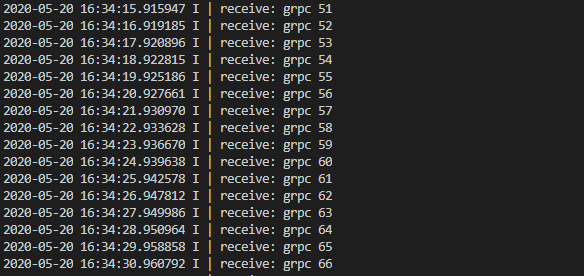
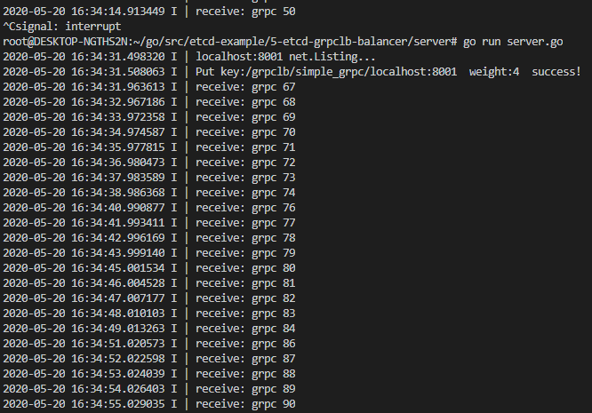

# [gRPC负载均衡（自定义负载均衡策略） ](https://www.cnblogs.com/FireworksEasyCool/p/12924701.html)

### 前言[#](https://www.cnblogs.com/FireworksEasyCool/p/12924701.html#1335180462)

上篇文章介绍了如何实现gRPC负载均衡，但目前官方只提供了`pick_first`和`round_robin`两种负载均衡策略，轮询法`round_robin`不能满足因服务器配置不同而承担不同负载量，这篇文章将介绍如何实现自定义负载均衡策略--`加权随机法`。

`加权随机法`可以根据服务器的处理能力而分配不同的权重，从而实现处理能力高的服务器可承担更多的请求，处理能力低的服务器少承担请求。

### 自定义负载均衡策略[#](https://www.cnblogs.com/FireworksEasyCool/p/12924701.html#916316825)

gRPC提供了`V2PickerBuilder`和`V2Picker`接口让我们实现自己的负载均衡策略。

```go
Copytype V2PickerBuilder interface {
	Build(info PickerBuildInfo) balancer.V2Picker
}
```

`V2PickerBuilder`接口：创建V2版本的子连接选择器。

`Build`方法：返回一个V2选择器，将用于gRPC选择子连接。

```go
Copytype V2Picker interface {
	Pick(info PickInfo) (PickResult, error)
}
```

`V2Picker`接口：用于gRPC选择子连接去发送请求。
`Pick`方法：子连接选择

问题来了，我们需要把服务器地址的权重添加进去，但是地址`resolver.Address`并没有提供权重的属性。官方给的答复是：把权重存储到地址的元数据`metadata`中。

```go
Copy// attributeKey is the type used as the key to store AddrInfo in the Attributes
// field of resolver.Address.
type attributeKey struct{}

// AddrInfo will be stored inside Address metadata in order to use weighted balancer.
type AddrInfo struct {
	Weight int
}

// SetAddrInfo returns a copy of addr in which the Attributes field is updated
// with addrInfo.
func SetAddrInfo(addr resolver.Address, addrInfo AddrInfo) resolver.Address {
	addr.Attributes = attributes.New()
	addr.Attributes = addr.Attributes.WithValues(attributeKey{}, addrInfo)
	return addr
}

// GetAddrInfo returns the AddrInfo stored in the Attributes fields of addr.
func GetAddrInfo(addr resolver.Address) AddrInfo {
	v := addr.Attributes.Value(attributeKey{})
	ai, _ := v.(AddrInfo)
	return ai
}
```

定义`AddrInfo`结构体并添加权重`Weight`属性，`Set`方法把`Weight`存储到`resolver.Address`中，`Get`方法从`resolver.Address`获取`Weight`。

解决权重存储问题后，接下来我们实现加权随机法负载均衡策略。

首先实现`V2PickerBuilder`接口，返回子连接选择器。

```go
Copyfunc (*rrPickerBuilder) Build(info base.PickerBuildInfo) balancer.V2Picker {
	grpclog.Infof("weightPicker: newPicker called with info: %v", info)
	if len(info.ReadySCs) == 0 {
		return base.NewErrPickerV2(balancer.ErrNoSubConnAvailable)
	}
	var scs []balancer.SubConn
	for subConn, addr := range info.ReadySCs {
		node := GetAddrInfo(addr.Address)
		if node.Weight <= 0 {
			node.Weight = minWeight
		} else if node.Weight > 5 {
			node.Weight = maxWeight
		}
		for i := 0; i < node.Weight; i++ {
			scs = append(scs, subConn)
		}
	}
	return &rrPicker{
		subConns: scs,
	}
}
```

`加权随机法`中，我使用空间换时间的方式，把权重转成地址个数（例如`addr1`的权重是`3`，那么添加`3`个子连接到切片中；`addr2`权重为`1`，则添加`1`个子连接；选择子连接时候，按子连接切片长度生成随机数，以随机数作为下标就是选中的子连接），避免重复计算权重。考虑到内存占用，权重定义从`1`到`5`权重。

接下来实现子连接的选择，获取随机数，选择子连接

```go
Copytype rrPicker struct {
	subConns []balancer.SubConn
	mu sync.Mutex
}

func (p *rrPicker) Pick(balancer.PickInfo) (balancer.PickResult, error) {
	p.mu.Lock()
	index := rand.Intn(len(p.subConns))
	sc := p.subConns[index]
	p.mu.Unlock()
	return balancer.PickResult{SubConn: sc}, nil
}
```

关键代码完成后，我们把加权随机法负载均衡策略命名为`weight`，并注册到gRPC的负载均衡策略中。

```go
Copy// Name is the name of weight balancer.
const Name = "weight"
// NewBuilder creates a new weight balancer builder.
func newBuilder() balancer.Builder {
	return base.NewBalancerBuilderV2(Name, &rrPickerBuilder{}, base.Config{HealthCheck: false})
}

func init() {
	balancer.Register(newBuilder())
}
```

完整代码[weight.go](https://github.com/Bingjian-Zhu/etcd-example/blob/master/5-etcd-grpclb-balancer/balancer/weight/weight.go)

最后，我们只需要在服务端注册服务时候附带权重，然后客户端在服务发现时把权重`Set`到`resolver.Address`中，最后客户端把负载论衡策略改成`weight`就完成了。

```go
Copy//SetServiceList 设置服务地址
func (s *ServiceDiscovery) SetServiceList(key, val string) {
	s.lock.Lock()
	defer s.lock.Unlock()
	//获取服务地址
	addr := resolver.Address{Addr: strings.TrimPrefix(key, s.prefix)}
	//获取服务地址权重
	nodeWeight, err := strconv.Atoi(val)
	if err != nil {
		//非数字字符默认权重为1
		nodeWeight = 1
	}
	//把服务地址权重存储到resolver.Address的元数据中
	addr = weight.SetAddrInfo(addr, weight.AddrInfo{Weight: nodeWeight})
	s.serverList[key] = addr
	s.cc.UpdateState(resolver.State{Addresses: s.getServices()})
	log.Println("put key :", key, "wieght:", val)
}
```

客户端使用`weight`负载均衡策略

```go
Copyfunc main() {
	r := etcdv3.NewServiceDiscovery(EtcdEndpoints)
	resolver.Register(r)
	// 连接服务器
	conn, err := grpc.Dial(
		fmt.Sprintf("%s:///%s", r.Scheme(), SerName),
		grpc.WithBalancerName("weight"),
		grpc.WithInsecure(),
	)
	if err != nil {
		log.Fatalf("net.Connect err: %v", err)
	}
	defer conn.Close()
```

运行效果：

运行`服务1`，权重为`1`

[](https://img2020.cnblogs.com/blog/1508611/202005/1508611-20200520162934052-74794177.png)

运行`服务2`，权重为`4`

[](https://img2020.cnblogs.com/blog/1508611/202005/1508611-20200520162941378-1116335906.png)

运行客户端

[](https://img2020.cnblogs.com/blog/1508611/202005/1508611-20200520163515073-1148862720.png)

查看前50次请求在`服务1`和`服务器2`的负载情况。`服务1`分配了`9`次请求，`服务2`分配了`41`次请求，接近权重比值。

[](https://img2020.cnblogs.com/blog/1508611/202005/1508611-20200520163753358-1654741743.png)

[](https://img2020.cnblogs.com/blog/1508611/202005/1508611-20200520163932810-2034341622.png)

断开`服务2`，所有请求流向`服务1`

[](https://img2020.cnblogs.com/blog/1508611/202005/1508611-20200520164432399-923288256.png)

以权重为`4`，重启`服务2`，请求以加权随机法流向两个服务器

[](https://img2020.cnblogs.com/blog/1508611/202005/1508611-20200520164648568-1117742551.png)

### 总结[#](https://www.cnblogs.com/FireworksEasyCool/p/12924701.html#1396484081)

本篇文章以加权随机法为例，介绍了如何实现gRPC自定义负载均衡策略，以满足我们的需求。

源码地址：https://github.com/Bingjian-Zhu/etcd-example