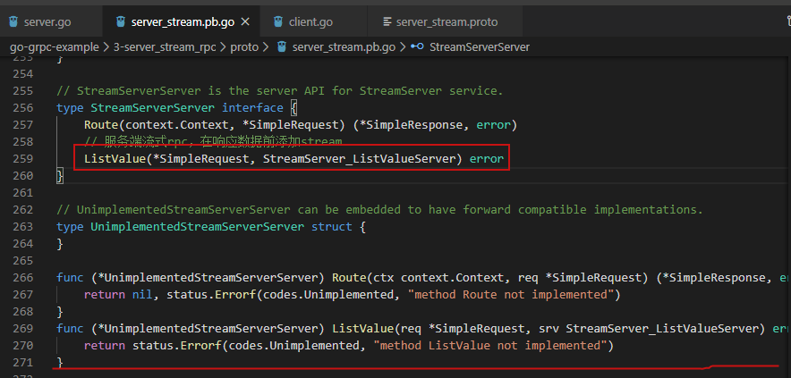

# [Go gRPC教程-服务端流式RPC（三） ](https://www.cnblogs.com/FireworksEasyCool/p/12693749.html)

### 前言[#](https://www.cnblogs.com/FireworksEasyCool/p/12693749.html#1390888693)

上一篇介绍了`简单模式RPC`，当数据量大或者需要不断传输数据时候，我们应该使用流式RPC，它允许我们边处理边传输数据。本篇先介绍`服务端流式RPC`。

`服务端流式RPC`：客户端发送请求到服务器，拿到一个流去读取返回的消息序列。 客户端读取返回的流，直到里面没有任何消息。

###### 情景模拟：实时获取股票走势。

1.客户端要获取某原油股的实时走势，客户端发送一个请求

2.服务端实时返回该股票的走势

### 新建proto文件[#](https://www.cnblogs.com/FireworksEasyCool/p/12693749.html#677868227)

新建server_stream.proto文件

1.定义发送信息

```protobuf
Copy// 定义发送请求信息
message SimpleRequest{
    // 定义发送的参数，采用驼峰命名方式，小写加下划线，如：student_name
    // 请求参数
    string data = 1;
}
```

2.定义接收信息

```protobuf
Copy// 定义流式响应信息
message StreamResponse{
    // 流式响应数据
    string stream_value = 1;
}
```

3.定义服务方法ListValue

服务端流式rpc，只要在响应数据前添加stream即可

```protobuf
Copy// 定义我们的服务（可定义多个服务,每个服务可定义多个接口）
service StreamServer{
    // 服务端流式rpc，在响应数据前添加stream
    rpc ListValue(SimpleRequest)returns(stream StreamResponse){};
}
```

4.编译proto文件

进入server_stream.proto所在目录，运行指令:

```
protoc --go_out=plugins=grpc:./ ./server_stream.proto
```

### 创建Server端[#](https://www.cnblogs.com/FireworksEasyCool/p/12693749.html#1451105982)

1.定义我们的服务，并实现ListValue方法

```go
Copy// SimpleService 定义我们的服务
type StreamService struct{}
// ListValue 实现ListValue方法
func (s *StreamService) ListValue(req *pb.SimpleRequest, srv pb.StreamServer_ListValueServer) error {
	for n := 0; n < 5; n++ {
		// 向流中发送消息， 默认每次send送消息最大长度为`math.MaxInt32`bytes
		err := srv.Send(&pb.StreamResponse{
			StreamValue: req.Data + strconv.Itoa(n),
		})
		if err != nil {
			return err
		}
	}
	return nil
}
```

初学者可能觉得比较迷惑，ListValue的参数和返回值是怎样确定的。其实这些都是编译proto时生成的.pb.go文件中有定义，我们只需要实现就可以了。

[](https://img2020.cnblogs.com/blog/1508611/202004/1508611-20200413200011972-285642192.png)

2.启动gRPC服务器

```go
Copyconst (
	// Address 监听地址
	Address string = ":8000"
	// Network 网络通信协议
	Network string = "tcp"
)

func main() {
	// 监听本地端口
	listener, err := net.Listen(Network, Address)
	if err != nil {
		log.Fatalf("net.Listen err: %v", err)
	}
	log.Println(Address + " net.Listing...")
	// 新建gRPC服务器实例
	// 默认单次接收最大消息长度为`1024*1024*4`bytes(4M)，单次发送消息最大长度为`math.MaxInt32`bytes
	// grpcServer := grpc.NewServer(grpc.MaxRecvMsgSize(1024*1024*4), grpc.MaxSendMsgSize(math.MaxInt32))
	grpcServer := grpc.NewServer()
	// 在gRPC服务器注册我们的服务
	pb.RegisterStreamServerServer(grpcServer, &StreamService{})

	//用服务器 Serve() 方法以及我们的端口信息区实现阻塞等待，直到进程被杀死或者 Stop() 被调用
	err = grpcServer.Serve(listener)
	if err != nil {
		log.Fatalf("grpcServer.Serve err: %v", err)
	}
}
```

运行服务端

```powershell
Copygo run server.go
:8000 net.Listing...
```

### 创建Client端[#](https://www.cnblogs.com/FireworksEasyCool/p/12693749.html#3742735199)

1.创建调用服务端ListValue方法

```go
Copy// listValue 调用服务端的ListValue方法
func listValue() {
	// 创建发送结构体
	req := pb.SimpleRequest{
		Data: "stream server grpc ",
	}
	// 调用我们的服务(ListValue方法)
	stream, err := grpcClient.ListValue(context.Background(), &req)
	if err != nil {
		log.Fatalf("Call ListStr err: %v", err)
	}
	for {
		//Recv() 方法接收服务端消息，默认每次Recv()最大消息长度为`1024*1024*4`bytes(4M)
		res, err := stream.Recv()
		// 判断消息流是否已经结束
		if err == io.EOF {
			break
		}
		if err != nil {
			log.Fatalf("ListStr get stream err: %v", err)
		}
		// 打印返回值
		log.Println(res.StreamValue)
	}
}
```

2.启动gRPC客户端

```go
Copy// Address 连接地址
const Address string = ":8000"

var grpcClient pb.StreamServerClient

func main() {
	// 连接服务器
	conn, err := grpc.Dial(Address, grpc.WithInsecure())
	if err != nil {
		log.Fatalf("net.Connect err: %v", err)
	}
	defer conn.Close()

	// 建立gRPC连接
	grpcClient = pb.NewStreamServerClient(conn)
	route()
	listValue()
}
```

运行客户端

```powershell
Copygo run client.go
stream server grpc 0
stream server grpc 1
stream server grpc 2
stream server grpc 3
stream server grpc 4
```

客户端不断从服务端获取数据

### 思考[#](https://www.cnblogs.com/FireworksEasyCool/p/12693749.html#3770001484)

假如服务端不停发送数据，类似获取股票走势实时数据，客户端能自己停止获取数据吗？

答案：可以的

1.我们把服务端的ListValue方法稍微修改

```go
Copy// ListValue 实现ListValue方法
func (s *StreamService) ListValue(req *pb.SimpleRequest, srv pb.StreamServer_ListValueServer) error {
	for n := 0; n < 15; n++ {
		// 向流中发送消息， 默认每次send送消息最大长度为`math.MaxInt32`bytes
		err := srv.Send(&pb.StreamResponse{
			StreamValue: req.Data + strconv.Itoa(n),
		})
		if err != nil {
			return err
		}
		log.Println(n)
		time.Sleep(1 * time.Second)
	}
	return nil
}
```

2.再把客户端调用ListValue方法的实现稍作修改，就可以得到结果了

```go
Copy// listValue 调用服务端的ListValue方法
func listValue() {
	// 创建发送结构体
	req := pb.SimpleRequest{
		Data: "stream server grpc ",
	}
	// 调用我们的服务(Route方法)
	// 同时传入了一个 context.Context ，在有需要时可以让我们改变RPC的行为，比如超时/取消一个正在运行的RPC
	stream, err := grpcClient.ListValue(context.Background(), &req)
	if err != nil {
		log.Fatalf("Call ListStr err: %v", err)
	}
	for {
		//Recv() 方法接收服务端消息，默认每次Recv()最大消息长度为`1024*1024*4`bytes(4M)
		res, err := stream.Recv()
		// 判断消息流是否已经结束
		if err == io.EOF {
			break
		}
		if err != nil {
			log.Fatalf("ListStr get stream err: %v", err)
		}
		// 打印返回值
		log.Println(res.StreamValue)
		break
	}
	//可以使用CloseSend()关闭stream，这样服务端就不会继续产生流消息
	//调用CloseSend()后，若继续调用Recv()，会重新激活stream，接着之前结果获取消息
	stream.CloseSend()
}
```

只需要调用`CloseSend()`方法，就可以关闭服务端的stream，让它停止发送数据。值得注意的是，调用`CloseSend()`后，若继续调用`Recv()`，会重新激活stream，接着当前的结果继续获取消息。

这能完美解决客户端`暂停`->`继续`获取数据的操作。

### 总结[#](https://www.cnblogs.com/FireworksEasyCool/p/12693749.html#3842649635)

本篇介绍了`服务端流式RPC`的简单使用，客户端发起一个请求，服务端不停返回数据，直到服务端停止发送数据或客户端主动停止接收数据为止。下篇将介绍`客户端流式RPC`。

教程源码地址：https://github.com/Bingjian-Zhu/go-grpc-example
参考：[gRPC官方文档中文版](http://doc.oschina.net/grpc?t=60133)