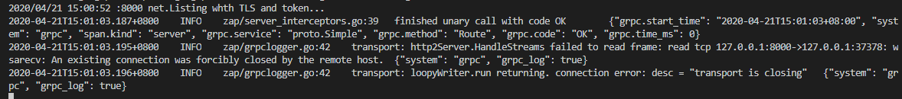

# [Go gRPC进阶-go-grpc-middleware使用（八） ](https://www.cnblogs.com/FireworksEasyCool/p/12750339.html)

### 前言[#](https://www.cnblogs.com/FireworksEasyCool/p/12750339.html#1069303534)

上篇介绍了gRPC中TLS认证和自定义方法认证，最后还简单介绍了gRPC拦截器的使用。gRPC自身只能设置一个拦截器，所有逻辑都写一起会比较乱。本篇简单介绍[go-grpc-middleware](https://github.com/grpc-ecosystem/go-grpc-middleware)的使用，包括`grpc_zap`、`grpc_auth`和`grpc_recovery`。

### go-grpc-middleware简介[#](https://www.cnblogs.com/FireworksEasyCool/p/12750339.html#1475467117)

go-grpc-middleware封装了认证（auth）, 日志（ logging）, 消息（message）, 验证（validation）, 重试（retries） 和监控（retries）等拦截器。

- 安装 `go get github.com/grpc-ecosystem/go-grpc-middleware`
- 使用

```go
Copyimport "github.com/grpc-ecosystem/go-grpc-middleware"
myServer := grpc.NewServer(
    grpc.StreamInterceptor(grpc_middleware.ChainStreamServer(
        grpc_ctxtags.StreamServerInterceptor(),
        grpc_opentracing.StreamServerInterceptor(),
        grpc_prometheus.StreamServerInterceptor,
        grpc_zap.StreamServerInterceptor(zapLogger),
        grpc_auth.StreamServerInterceptor(myAuthFunction),
        grpc_recovery.StreamServerInterceptor(),
    )),
    grpc.UnaryInterceptor(grpc_middleware.ChainUnaryServer(
        grpc_ctxtags.UnaryServerInterceptor(),
        grpc_opentracing.UnaryServerInterceptor(),
        grpc_prometheus.UnaryServerInterceptor,
        grpc_zap.UnaryServerInterceptor(zapLogger),
        grpc_auth.UnaryServerInterceptor(myAuthFunction),
        grpc_recovery.UnaryServerInterceptor(),
    )),
)
```

`grpc.StreamInterceptor`中添加流式RPC的拦截器。
`grpc.UnaryInterceptor`中添加简单RPC的拦截器。

### grpc_zap日志记录[#](https://www.cnblogs.com/FireworksEasyCool/p/12750339.html#3471575446)

1.创建zap.Logger实例

```go
Copyfunc ZapInterceptor() *zap.Logger {
	logger, err := zap.NewDevelopment()
	if err != nil {
		log.Fatalf("failed to initialize zap logger: %v", err)
	}
	grpc_zap.ReplaceGrpcLogger(logger)
	return logger
}
```

2.把zap拦截器添加到服务端

```go
CopygrpcServer := grpc.NewServer(
	grpc.StreamInterceptor(grpc_middleware.ChainStreamServer(
			grpc_zap.StreamServerInterceptor(zap.ZapInterceptor()),
		)),
		grpc.UnaryInterceptor(grpc_middleware.ChainUnaryServer(
			grpc_zap.UnaryServerInterceptor(zap.ZapInterceptor()),
		)),
	)
```

3.日志分析

[](https://img2020.cnblogs.com/blog/1508611/202004/1508611-20200421150239484-1399156155.png)
各个字段代表的意思如下：

```json
Copy{
	  "level": "info",						// string  zap log levels
	  "msg": "finished unary call",					// string  log message

	  "grpc.code": "OK",						// string  grpc status code
	  "grpc.method": "Ping",					/ string  method name
	  "grpc.service": "mwitkow.testproto.TestService",              // string  full name of the called service
	  "grpc.start_time": "2006-01-02T15:04:05Z07:00",               // string  RFC3339 representation of the start time
	  "grpc.request.deadline": "2006-01-02T15:04:05Z07:00",         // string  RFC3339 deadline of the current request if supplied
	  "grpc.request.value": "something",				// string  value on the request
	  "grpc.time_ms": 1.345,					// float32 run time of the call in ms

	  "peer.address": {
	    "IP": "127.0.0.1",						// string  IP address of calling party
	    "Port": 60216,						// int     port call is coming in on
	    "Zone": ""							// string  peer zone for caller
	  },
	  "span.kind": "server",					// string  client | server
	  "system": "grpc",						// string

	  "custom_field": "custom_value",				// string  user defined field
	  "custom_tags.int": 1337,					// int     user defined tag on the ctx
	  "custom_tags.string": "something"				// string  user defined tag on the ctx
}
```

4.把日志写到文件中

上面日志是在控制台输出的，现在我们把日志写到文件中，修改`ZapInterceptor`方法。

```go
Copyimport (
	grpc_zap "github.com/grpc-ecosystem/go-grpc-middleware/logging/zap"
	"go.uber.org/zap"
	"go.uber.org/zap/zapcore"
	"gopkg.in/natefinch/lumberjack.v2"
)

// ZapInterceptor 返回zap.logger实例(把日志写到文件中)
func ZapInterceptor() *zap.Logger {
	w := zapcore.AddSync(&lumberjack.Logger{
		Filename:  "log/debug.log",
		MaxSize:   1024, //MB
		LocalTime: true,
	})

	config := zap.NewProductionEncoderConfig()
	config.EncodeTime = zapcore.ISO8601TimeEncoder
	core := zapcore.NewCore(
		zapcore.NewJSONEncoder(config),
		w,
		zap.NewAtomicLevel(),
	)

	logger := zap.New(core, zap.AddCaller(), zap.AddCallerSkip(1))
	grpc_zap.ReplaceGrpcLogger(logger)
	return logger
}
```

### grpc_auth认证[#](https://www.cnblogs.com/FireworksEasyCool/p/12750339.html#181274961)

go-grpc-middleware中的grpc_auth默认使用`authorization`认证方式，以authorization为头部，包括`basic`, `bearer`形式等。下面介绍`bearer token`认证。`bearer`允许使用`access key`（如JSON Web Token (JWT)）进行访问。

1.新建grpc_auth服务端拦截器

```go
Copy// TokenInfo 用户信息
type TokenInfo struct {
	ID    string
	Roles []string
}

// AuthInterceptor 认证拦截器，对以authorization为头部，形式为`bearer token`的Token进行验证
func AuthInterceptor(ctx context.Context) (context.Context, error) {
	token, err := grpc_auth.AuthFromMD(ctx, "bearer")
	if err != nil {
		return nil, err
	}
	tokenInfo, err := parseToken(token)
	if err != nil {
		return nil, grpc.Errorf(codes.Unauthenticated, " %v", err)
	}
	//使用context.WithValue添加了值后，可以用Value(key)方法获取值
	newCtx := context.WithValue(ctx, tokenInfo.ID, tokenInfo)
	//log.Println(newCtx.Value(tokenInfo.ID))
	return newCtx, nil
}

//解析token，并进行验证
func parseToken(token string) (TokenInfo, error) {
	var tokenInfo TokenInfo
	if token == "grpc.auth.token" {
		tokenInfo.ID = "1"
		tokenInfo.Roles = []string{"admin"}
		return tokenInfo, nil
	}
	return tokenInfo, errors.New("Token无效: bearer " + token)
}

//从token中获取用户唯一标识
func userClaimFromToken(tokenInfo TokenInfo) string {
	return tokenInfo.ID
}
```

代码中的对token进行简单验证并返回模拟数据。

2.客户端请求添加`bearer token`

实现和上篇的自定义认证方法大同小异。gRPC 中默认定义了 `PerRPCCredentials`，是提供用于自定义认证的接口，它的作用是将所需的安全认证信息添加到每个RPC方法的上下文中。其包含 2 个方法：

- `GetRequestMetadata`：获取当前请求认证所需的元数据
- `RequireTransportSecurity`：是否需要基于 TLS 认证进行安全传输

接下来我们实现这两个方法

```go
Copy// Token token认证
type Token struct {
	Value string
}

const headerAuthorize string = "authorization"

// GetRequestMetadata 获取当前请求认证所需的元数据
func (t *Token) GetRequestMetadata(ctx context.Context, uri ...string) (map[string]string, error) {
	return map[string]string{headerAuthorize: t.Value}, nil
}

// RequireTransportSecurity 是否需要基于 TLS 认证进行安全传输
func (t *Token) RequireTransportSecurity() bool {
	return true
}
```

> 注意：这里要以`authorization`为头部，和服务端对应。

发送请求时添加token

```go
Copy//从输入的证书文件中为客户端构造TLS凭证
	creds, err := credentials.NewClientTLSFromFile("../tls/server.pem", "go-grpc-example")
	if err != nil {
		log.Fatalf("Failed to create TLS credentials %v", err)
	}
	//构建Token
	token := auth.Token{
		Value: "bearer grpc.auth.token",
	}
	// 连接服务器
	conn, err := grpc.Dial(Address, grpc.WithTransportCredentials(creds), grpc.WithPerRPCCredentials(&token))
```

> 注意：Token中的Value的形式要以`bearer token值`形式。因为我们服务端使用了`bearer token`验证方式。

3.把grpc_auth拦截器添加到服务端

```go
CopygrpcServer := grpc.NewServer(cred.TLSInterceptor(),
	grpc.StreamInterceptor(grpc_middleware.ChainStreamServer(
	        grpc_auth.StreamServerInterceptor(auth.AuthInterceptor),
			grpc_zap.StreamServerInterceptor(zap.ZapInterceptor()),
		)),
		grpc.UnaryInterceptor(grpc_middleware.ChainUnaryServer(
		    grpc_auth.UnaryServerInterceptor(auth.AuthInterceptor),
			grpc_zap.UnaryServerInterceptor(zap.ZapInterceptor()),
		)),
	)
```

写到这里，服务端都会拦截请求并进行`bearer token`验证，使用`bearer token`是规范了与`HTTP`请求的对接，毕竟gRPC也可以同时支持`HTTP`请求。

### grpc_recovery恢复[#](https://www.cnblogs.com/FireworksEasyCool/p/12750339.html#2491338157)

把gRPC中的`panic`转成`error`，从而恢复程序。

1.直接把grpc_recovery拦截器添加到服务端

最简单使用方式

```go
CopygrpcServer := grpc.NewServer(cred.TLSInterceptor(),
	grpc.StreamInterceptor(grpc_middleware.ChainStreamServer(
	        grpc_auth.StreamServerInterceptor(auth.AuthInterceptor),
			grpc_zap.StreamServerInterceptor(zap.ZapInterceptor()),
			grpc_recovery.StreamServerInterceptor,
		)),
		grpc.UnaryInterceptor(grpc_middleware.ChainUnaryServer(
		    grpc_auth.UnaryServerInterceptor(auth.AuthInterceptor),
			grpc_zap.UnaryServerInterceptor(zap.ZapInterceptor()),
            grpc_recovery.UnaryServerInterceptor(),
		)),
	)
```

2.自定义错误返回

当`panic`时候，自定义错误码并返回。

```go
Copy// RecoveryInterceptor panic时返回Unknown错误吗
func RecoveryInterceptor() grpc_recovery.Option {
	return grpc_recovery.WithRecoveryHandler(func(p interface{}) (err error) {
		return grpc.Errorf(codes.Unknown, "panic triggered: %v", p)
	})
}
```

添加grpc_recovery拦截器到服务端

```go
CopygrpcServer := grpc.NewServer(cred.TLSInterceptor(),
	grpc.StreamInterceptor(grpc_middleware.ChainStreamServer(
	        grpc_auth.StreamServerInterceptor(auth.AuthInterceptor),
			grpc_zap.StreamServerInterceptor(zap.ZapInterceptor()),
			grpc_recovery.StreamServerInterceptor(recovery.RecoveryInterceptor()),
		)),
		grpc.UnaryInterceptor(grpc_middleware.ChainUnaryServer(
		    grpc_auth.UnaryServerInterceptor(auth.AuthInterceptor),
			grpc_zap.UnaryServerInterceptor(zap.ZapInterceptor()),
            grpc_recovery.UnaryServerInterceptor(recovery.RecoveryInterceptor()),
		)),
	)
```

### 总结[#](https://www.cnblogs.com/FireworksEasyCool/p/12750339.html#257219919)

本篇介绍了`go-grpc-middleware`中的`grpc_zap`、`grpc_auth`和`grpc_recovery`拦截器的使用。`go-grpc-middleware`中其他拦截器可参考[GitHub](https://github.com/grpc-ecosystem/go-grpc-middleware)学习使用。

教程源码地址：https://github.com/Bingjian-Zhu/go-grpc-example